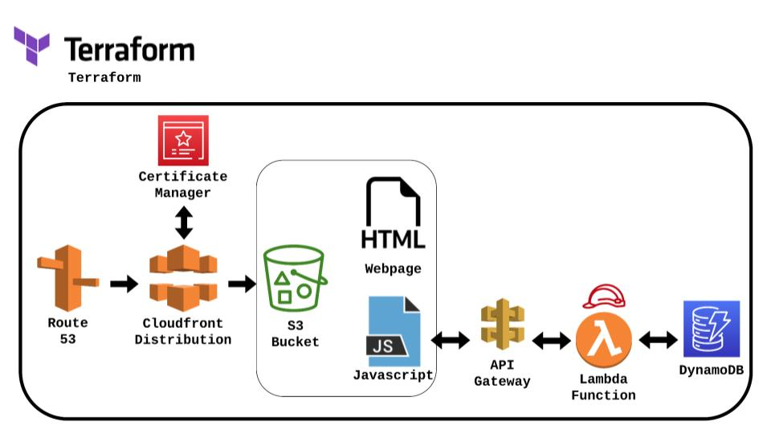

# The Cloud Resume Challenge - Terraform

This repo solves the challenge of The Cloud Resume Challenge by Forrest Brazeal:  https://cloudresumechallenge.dev/docs/the-challenge/aws/

The Cloud Resume Challenge is a hands-on project designed to help you bridge the gap from cloud certification to cloud job. It incorporates many of the skills that real cloud and DevOps engineers use in their daily work.

This repo is a Terraform project that deploys and configures almos everything required for the challenge, using Amazon Web Services.

## General Details

This project does not:
1) Create automatically ACM Certificate (It is above AWS Free Tier)
2) Upload counter.js to the bucket. You have to modify Cloudfront DNS from your project and upload it manually
3) Create Route53 alias to Cloudfront

**********************************
*************** S3 ***************
**********************************

1) S3Bucket: Create bucket to store webpage
2) Block all public access
3) Upload the webpage files. Only index.html
4) Apply Bucket Resource policy
5) Object properties: ACL Disabled

**********************************
*********** CLOUDFRONT ***********
**********************************

1) Create Cloudfron distribution
2) Origin s3 DNS
3) Origin access control. Origin type s3. Ensure bucket policy
4) Default root object: index.html
5) Disable Cache
6) Price Class: North America & Europe. PriceClass_100
7) Alternate domain name & custom SSL Certificate
8) Origin Access
9) Alternate domain names: terraform.juanvarela.com.ar

**********************************
******* CERTIFICATE MANAGER ******
**********************************

1) Create public certificate. Specify domain
2) Add the new certificate with the hosted zone (Route 53)
3) Update acm_certificate_arn

**********************************
************ DYNAMODB ************
**********************************

1) DynamoDB Table: VisitorCount
2) On demand
3) Index PageName String, Attribute Count Number
4) Add an item PageName = "1", Count = "0"

**********************************
************ IAM ROLE ************
**********************************

1) Generate a Role so Lambda can access DynamoDB Table

**********************************
************* LAMBDA *************
**********************************

1) Create function VisitorCountersTerraform
2) Function type Node.js 12.x
3) Copy Function

**********************************
*********** API GATEWAY **********
**********************************

1) Create REST API Gateway VisitorCounterTerraform
2) Create Resource, configure as proxy
3) Create Method ANY, Authorization NONE,   Lambda function proxy
4) Deploy API, stage name dev
5) Allow API Gateway invoke Lambda